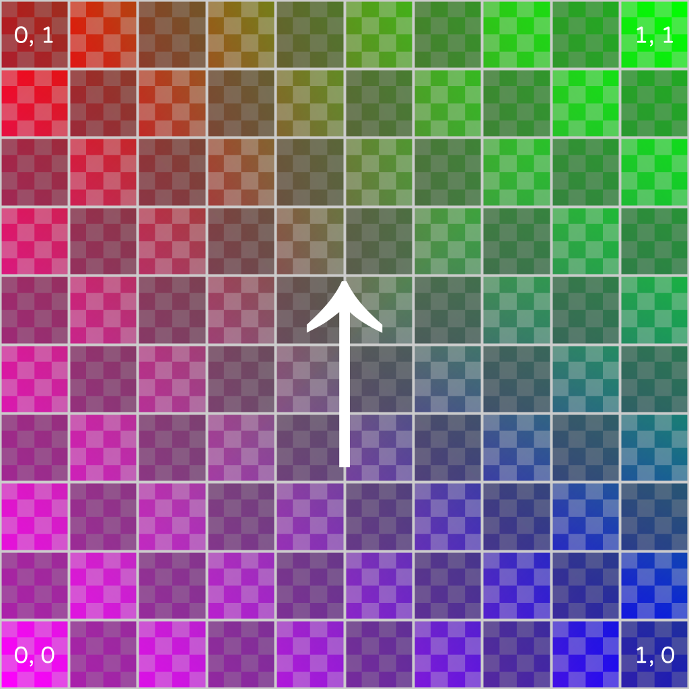
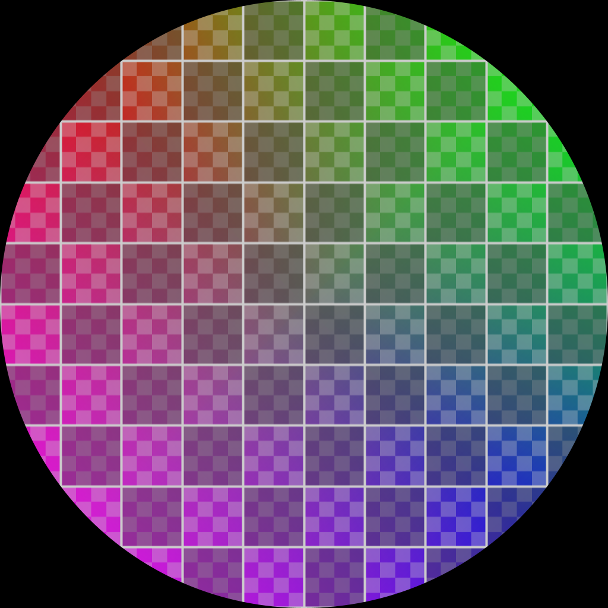
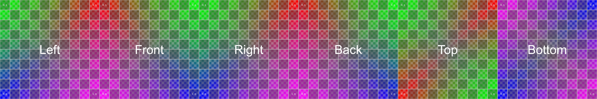
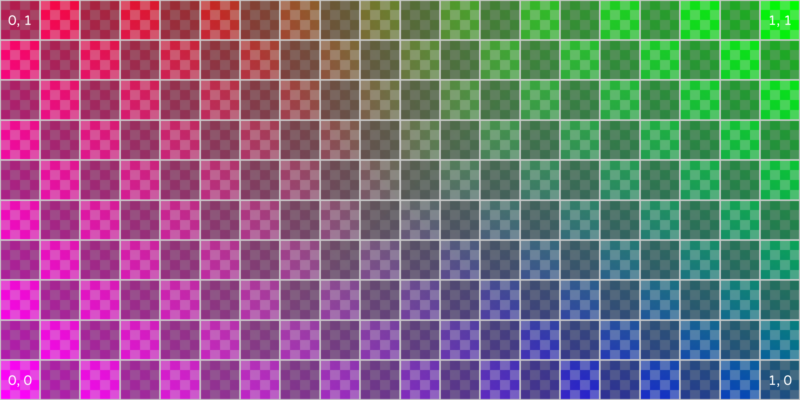
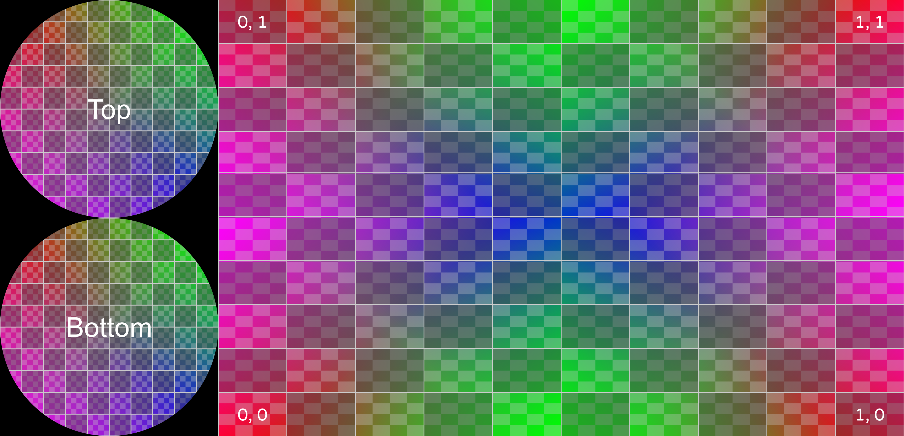

# Construct
A C++ Primitive shape generator library

## 2D Primitives
```C++
Quad()
```
Generates a quad facing the -Z direction by default

```C++
Plane(unsigned int width, unsigned int height)
```
Generates a plane of width * height tiles facing the +Y direction by default

```C++
Polygon(unsigned int sides)
```
Generates a polygon facing the -Z direction by default. High side counts can be used for circles


## 3D Primitives
```C++
Cube()
```
Generates a 24 vertex cube with correct normals and example texture shown below (Front facing -Z)

```C++
UVSphere(unsigned int rings, unsigned int segments)
```
Generates a UV sphere with a number of rings and segments. Useful for easy texturing

```C++
Icosphere(unsigned int subdivisions)
```
Generates a subdivided icosphere. More organic looking due to it's uniformity. Useful for heightmapping.
Generally keep subdivisions below 10, Number of triangles grows exponentially

```C++
Cylinder(unsigned int sides)
```
Generates a cylinder with a given number of sides. Low side counts can be used for prisms

```C++
Capsule()
```
Generates the classic capsule shape.


## Skyboxes
```C++
SkyboxCube()
```
Generates a Cube skybox

```C++
SkyboxSphere()
```
Generates a Sphere skybox

